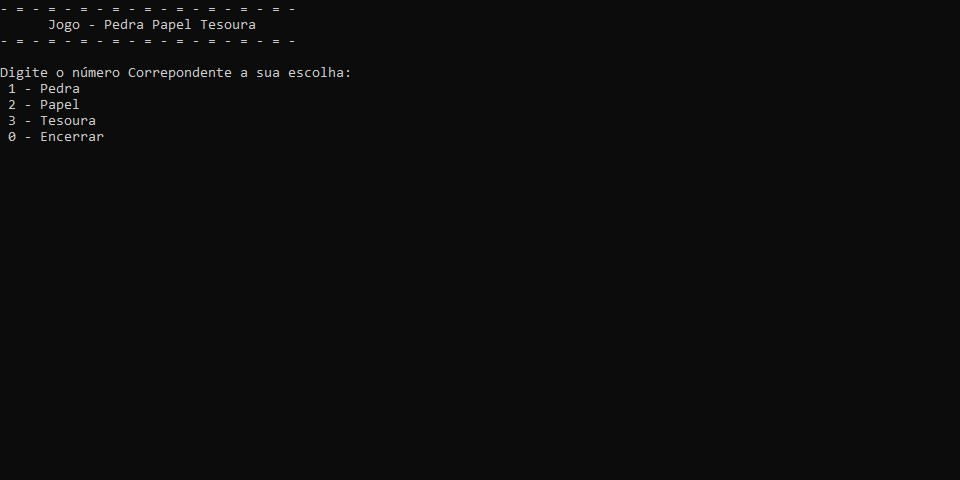

## Pedra Papel Tesoura



O jogo Pedra Papel e Tesoura é uma aplicação de console desenvolvida em C# que simula uma batalha entre jogador e computador.
O programa recebe a escolhida do jogador, processsa a escolha do computador e compara para ver quem ganhou.

## Funcionalidades

- **Entrada do jogador**: Permite escolher entre Pedra, Papel ou Tesoura.
- **Escolha aleatória do computador**: O sistema gera automaticamente a jogada do PC.
- **Comparação de resultados**: Define se houve vitória, derrota ou empate.
- **Exibição visual (ASCII)**: Mostra as mãos do jogador e do computador no console.
- **Loop de partidas**: Permite jogar várias vezes sem reiniciar o programa.

## Como jogar

Digite o número correspondente à sua escolha:
- 1 - Pedra
- 2 - Papel
- 3 - Tesoura
- 0 - Sair

Após a escolha, pressione **ENTER** para revelar o resultado.
O jogo exibirá os desenhos e informará o vencedor.

## Como utilizar o programa

1. Clone o repositório ou baixe o código em `.zip`.
2. Abra o terminal e navegue até a pasta raiz do projeto.
3. Execute o comando abaixo para restaurar as dependências:

    ```
    dotnet restore
    ```

4. Depois, execute o projeto com:

    ```
    dotnet run --project PedraPapelTesoura.ConsoleApp
    ```

5. Informe os dados solicitados pelo programa e acompanhe a simulação do robô.

## Requisitos

- .NET SDK 10.0